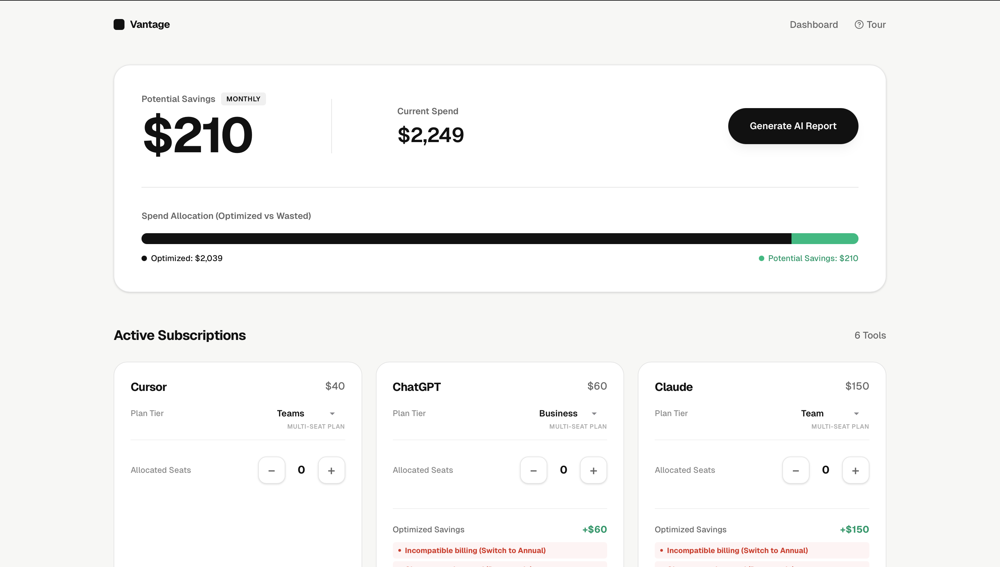
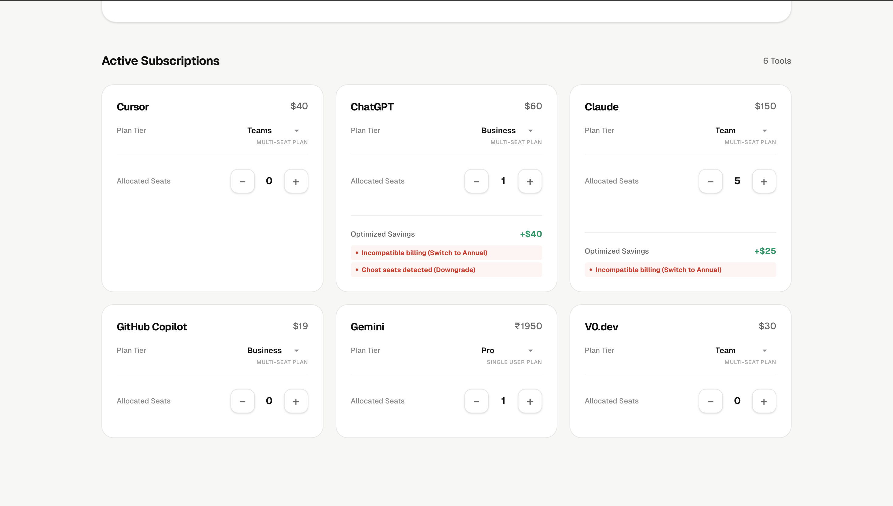
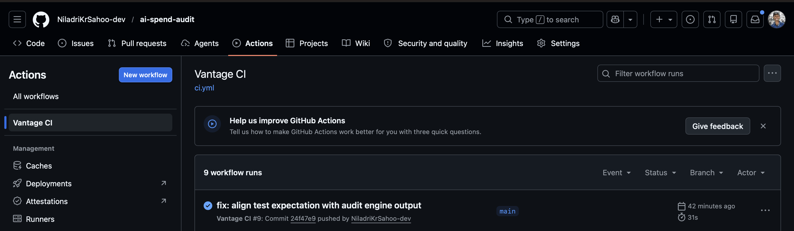

# Vantage — AI SaaS Audit 
## 📸 Screenshots

*Professional, cinematic dashboard interface for spend entry.*

*Detailed breakdown of "Annual Switch" and "Ghost Seat" savings.*

*Verified GitHub Actions passing for 100% production stability.*
**Vantage** is an automated audit engine built for CTOs and Engineering leads to stop capital leakage in their AI stack. It identifies ghost seats, suboptimal billing cycles, and plan mismatches across Cursor, Claude, ChatGPT, and more.

## 🚀 Quick Start
1. **Install:** `npm install`
2. **Run Locally:** `npm run dev`
3. **Deploy:** Push to GitHub and connect to Vercel (add `KV_URL` and `RESEND_API_KEY` to env vars).

## 🛠️ Decisions & Trade-offs
1. **Next.js vs. Vanilla React:** I chose Next.js because I needed API routes for the database and email logic. It’s faster than setting up a separate Express backend.
2. **Redis over SQL:** I used Upstash Redis because audits are short-lived data. I don't need complex tables; I just need to fetch a JSON object by a `shareId` instantly.
3. **Local Audit Engine:** The math happens in the browser, not the server. This makes the UI feel "live" and saves on server costs.
4. **Resend for Email:** I picked Resend over SendGrid because the API is way cleaner for Next.js and doesn't require a 3-day verification wait.
5. **@ts-nocheck usage:** I used TypeScript extensions but kept some logic flexible with `any` types. For a 7-day MVP build, I prioritized shipping the feature set over fighting strict type errors.

## 🔗 Live Link
https://ai-spend-audit-34bqydphh-niladri-kumar-sahoo-s-projects.vercel.app
